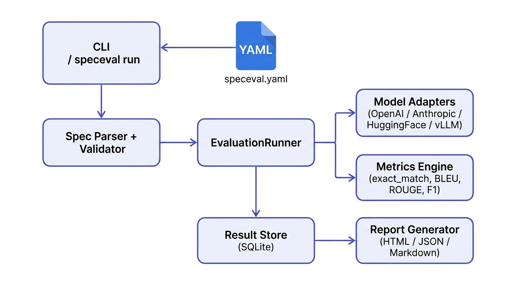
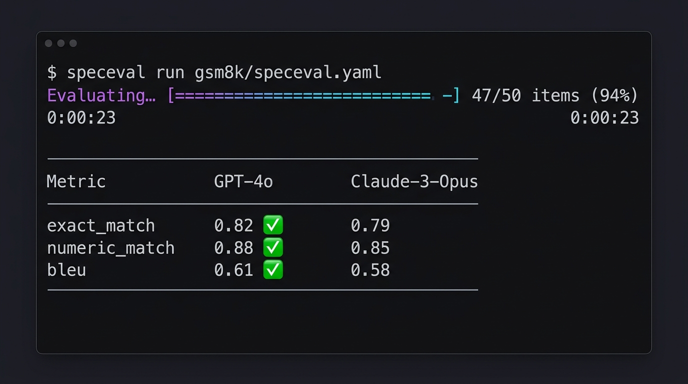

# Welcome to SpecEval

**Reproducible evaluation specifications for AI systems.**

SpecEval is a framework that lets you define AI evaluations as version-controlled, auditable, and composable YAML. It promotes reproducibility and rigour in ML research workflows.

<figure>
  
  <figcaption>SpecEval Architecture Diagram</figcaption>
</figure>

---

## 🎯 Why SpecEval?

Evaluation today consists of ad-hoc scripts scattered across notebooks, internal dashboards, and undocumented workflows. Every team reinvents the same pipeline — loading models, formatting prompts, scoring outputs — with subtle differences that make results impossible to compare or reproduce.

**SpecEval brings declarative evaluation specifications to AI.** You write a single YAML file that describes exactly what to evaluate, which models to test, what metrics to compute, and how to present results. 

That spec lives in your repository, gets run in CI, and produces portable HTML reports anyone can inspect. Same spec, same results, every time. No hidden randomness, no script drift.

---

## ⚡ Quick Start

Get started with SpecEval in less than a minute.

=== "pip"
    ```bash
    pip install speceval
    ```
    
=== "poetry"
    ```bash
    poetry add speceval
    ```

Once installed, use the CLI to initialize and run your first evaluation:

```bash
speceval init my-eval
speceval run my-eval/speceval.yaml
speceval report my-eval --open
```

<figure>
  
  <figcaption>Running an evaluation using the CLI</figcaption>
</figure>

---

## 🚀 Features

- **Declarative YAML Specs**: Define models, datasets, and metrics in one place.
- **Multi-Provider Support**: Out-of-the-box adapters for `openai`, `anthropic`, `huggingface`, and `vllm`.
- **Extensible Metrics Engine**: Built-in support for exact match, BLEU, ROUGE, precision, recall, and more. Easily plug in your own custom metric functions.
- **Reproducible Execution**: Locks seeds, tracks prompts, and guarantees consistent evaluation states.
- **Rich Reporting**: Generate beautiful, interactive HTML reports to share with your team.

---

## 📖 Example: GSM8K Math Reasoning

The following spec evaluates two LLMs on grade-school math reasoning and produces a head-to-head comparison report in one command:

```yaml title="speceval.yaml"
name: gsm8k-mini-demo
description: Comparing GPT-4o vs Claude on 50 GSM8K samples

dataset:
  path: speceval/gsm8k
  split: test
  subset: main
  limit: 50  # quick smoke-test

models:
  - id: openai/gpt-4o
    provider: openai
    params: { temperature: 0, max_tokens: 512 }
  - id: anthropic/claude-3-opus-20240229
    provider: anthropic
    params: { temperature: 0, max_tokens: 512 }

prompt:
  template: |
    Solve step by step.

    {question}

    Answer:
  variables:
    question: question

metrics:
  - exact_match
  - numeric_match

report:
  format: html
  output: gsm8k-demo-report.html
  include: [scores, examples]
```

---

## 🤝 Contributing

We welcome contributions! Please see our Contributing Guide for more details. 

1. Fork the Project
2. Create your Feature Branch (`git checkout -b feature/AmazingFeature`)
3. Commit your Changes (`git commit -m 'Add some AmazingFeature'`)
4. Push to the Branch (`git push origin feature/AmazingFeature`)
5. Open a Pull Request

## 🛡️ Security

If you discover any security related issues, please report them to the maintainers privately via GitHub Security Advisories or via email. See `SECURITY.md`.

## 📄 License

Distributed under the Apache 2.0 License. See `LICENSE` for more information.
